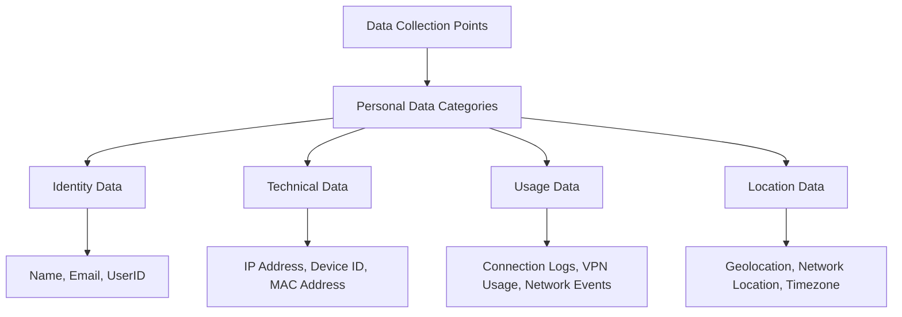
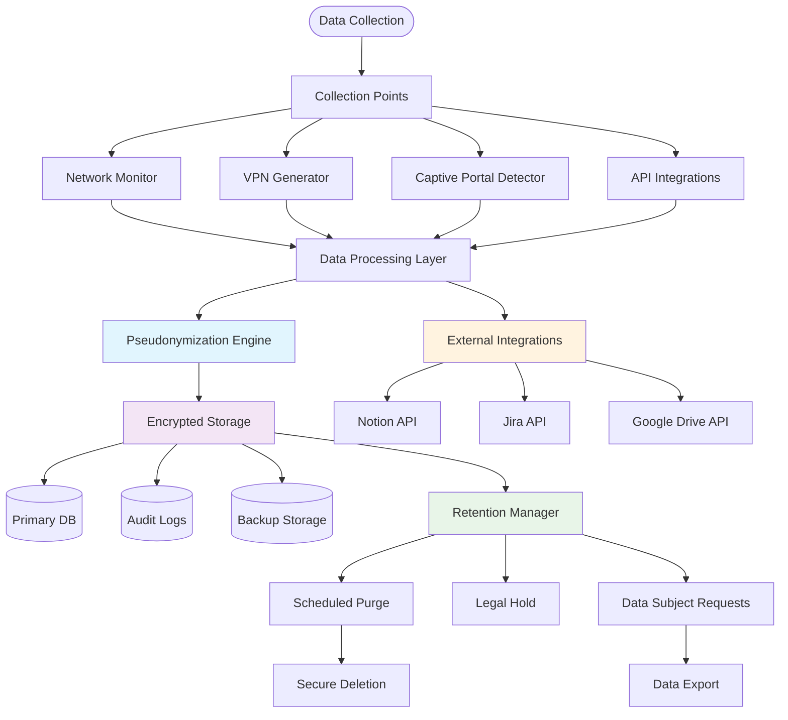
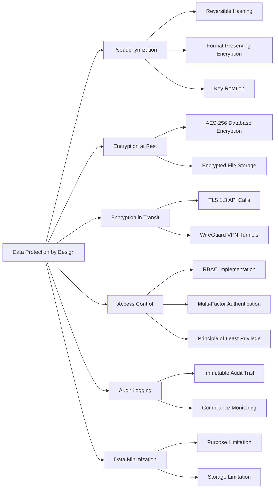
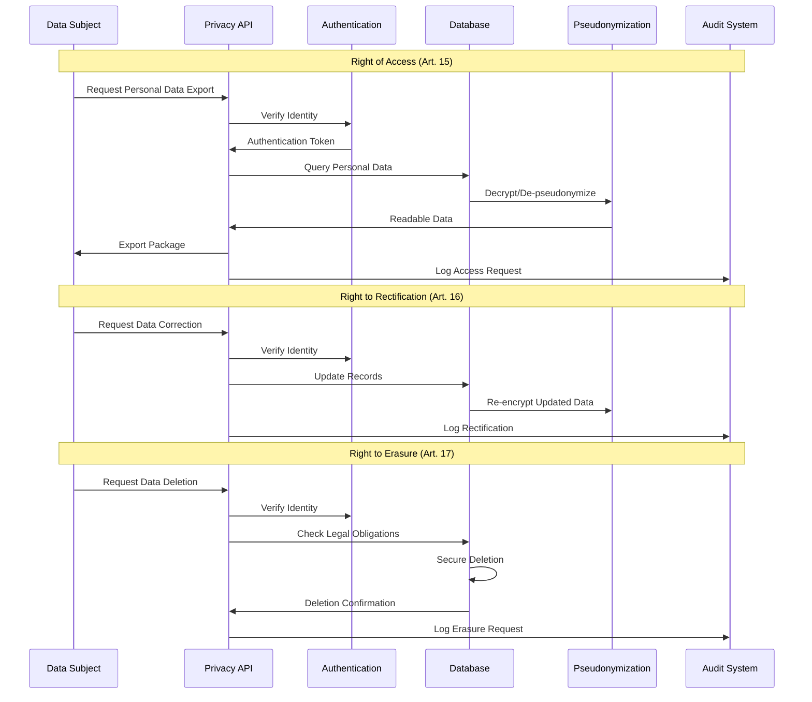
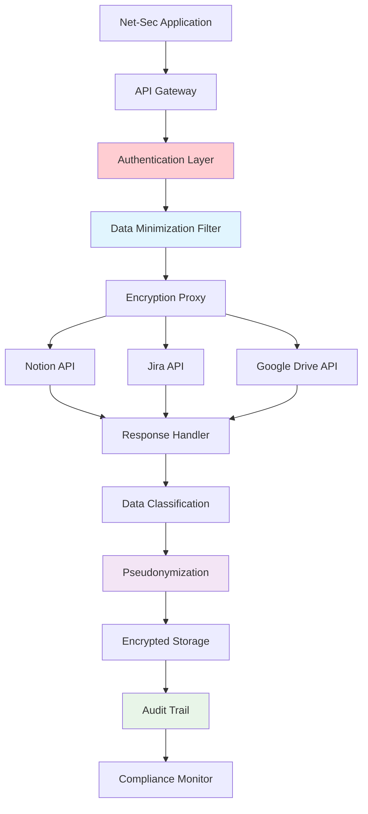
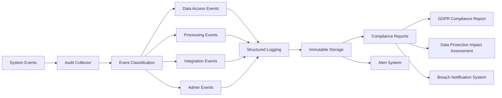
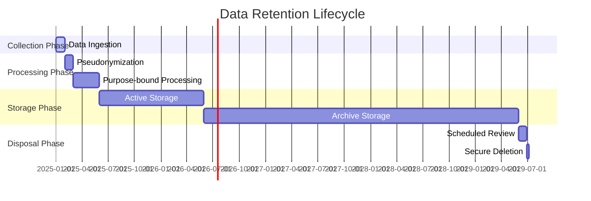

# GDPR Compliance Data Flow Architecture

## Personal Data Classification

### Data Categories



### Data Processing Flow



## GDPR Article 25: Data Protection by Design

### Technical Measures



### Data Subject Rights Implementation



## Integration Security Architecture

### External API Data Flow



### Audit Trail Requirements



## Retention Policy Framework

### Data Lifecycle Management



### Retention Rules by Data Type

```yaml
retention_policies:
  network_logs:
    retention_period: "12 months"
    purge_method: "secure_deletion"
    legal_hold_applicable: true

  user_preferences:
    retention_period: "24 months"
    purge_method: "anonymization"
    legal_hold_applicable: false

  authentication_logs:
    retention_period: "36 months"
    purge_method: "secure_deletion"
    legal_hold_applicable: true

  api_integration_data:
    retention_period: "6 months"
    purge_method: "complete_removal"
    legal_hold_applicable: false

  audit_trails:
    retention_period: "84 months"
    purge_method: "never" # Regulatory requirement
    legal_hold_applicable: true
```

## Privacy Controls Matrix

| Data Type        | Collection Basis    | Purpose             | Retention        | Subject Rights        | Security Level |
| ---------------- | ------------------- | ------------------- | ---------------- | --------------------- | -------------- |
| Network Metadata | Legitimate Interest | Service Operation   | 12 months        | Access, Portability   | High           |
| User Credentials | Contract            | Authentication      | Account Lifetime | Access, Rectification | Critical       |
| Usage Analytics  | Consent             | Service Improvement | 6 months         | Access, Withdrawal    | Medium         |
| Integration Data | Consent             | Feature Enhancement | 3 months         | Access, Erasure       | High           |
| Audit Logs       | Legal Obligation    | Compliance          | 7 years          | Access (Limited)      | Critical       |
| Backup Data      | Legitimate Interest | Disaster Recovery   | Same as Primary  | Same as Primary       | Critical       |

## Implementation Priorities

### Phase 1: Core Infrastructure (Weeks 1-2)

- [ ] Pseudonymization library implementation
- [ ] Database encryption setup
- [ ] Basic audit logging
- [ ] RBAC foundation

### Phase 2: GDPR Compliance (Weeks 3-4)

- [ ] Data subject rights API
- [ ] Retention policy engine
- [ ] Consent management
- [ ] Privacy dashboard

### Phase 3: External Integrations (Weeks 5-6)

- [ ] Secure API connectors
- [ ] Data minimization filters
- [ ] Integration audit trails
- [ ] Breach detection system

### Phase 4: Monitoring & Automation (Weeks 7-8)

- [ ] Compliance monitoring dashboard
- [ ] Automated retention jobs
- [ ] Alert systems
- [ ] Compliance reporting

## Legal Basis Documentation

### Article 6 GDPR - Lawfulness of Processing

```yaml
legal_bases:
  network_monitoring:
    basis: "legitimate_interest"
    assessment: "Network security and service stability"
    balancing_test: "User privacy vs. security necessity"

  user_authentication:
    basis: "contract"
    necessity: "Service delivery requirement"

  analytics_data:
    basis: "consent"
    consent_mechanism: "Granular opt-in"
    withdrawal_method: "One-click revocation"

  compliance_logging:
    basis: "legal_obligation"
    regulatory_source: "eIDAS, NIS2, GDPR Article 5(2)"
```

This comprehensive data flow architecture ensures GDPR compliance while maintaining the security functionality of the net-sec tool. Next, I'll implement the pseudonymization library.
